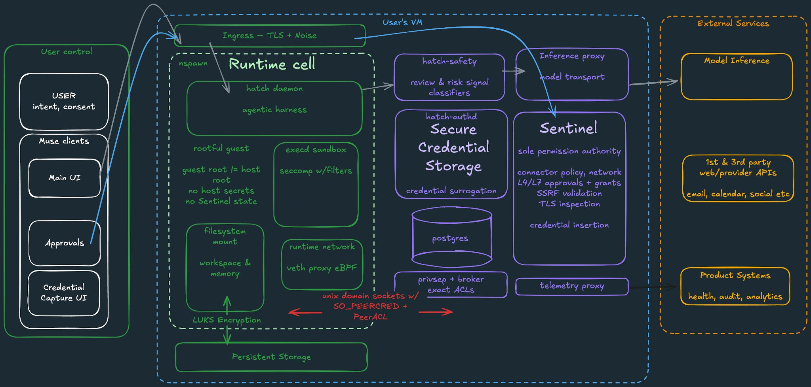

# 生产级架构：墙外的另一半

> 阅读指南：本文写的是从容器内**看不见**的那一半。严格区分三类陈述：
> - ✅ **实测痕迹**：容器内可见的证据（环境变量、脚本、挂载、socket 名）
> - 🔍 **强推断**：证据 + 工程常识下几乎唯一的解释
> - 💭 **设计推演**：生产级必须回答的问题，以及合理的答案（可能与真实实现有出入）
>
> 与之相对，`README.md` / `runtime-internals.md` / `architect-notes.md` 写的是墙内的一半（全部实测）。

## 0. 官方印证：Meta Research 博客（2026-09）

Meta 官方发布了 [How We Built Safety Into Muse](https://research.meta.ai/blog/security-and-safety-for-ai-agents-our-approach-with-muse)，
亲述生产级安全/安全架构。逐条对照本仓库的推断：

| 博客披露 | 本仓库对应位置 | 状态 |
|---|---|---|
| `systemd-nspawn` runtime cell；Hatch 为 Muse 的内部代号 | README 总览 | ✅ 确认 |
| cell 内 root 映射为非特权 host 用户（user namespace） | — | ➕ 新增 |
| 过滤 syscall（如无 `io_uring`）、限制 capability | architect-notes §4 | 🔧 见下注 |
| Sentinel 是连接器动作与网络出站的**唯一**审批权威 | §2.6 / §2.11 | ✅ 确认 |
| surrogate token：authd 签发替身，Sentinel 在网络边界替换为真凭证，agent 永不见真密钥 | §2.5 | ✅ 确认（与 github skill 中 `hsurr:*` 机制互证） |
| cell 与 VM 服务经 Unix socket + `SO_PEERCRED` + peer ACL 通信，无秘密可偷 | runtime-internals §3 | ✅ 确认 |
| `privsep` workers 在 cell 外执行连接器逻辑，凭证不出 agent 作用域 | architect-notes 未解 #6 | ✅ 官方解答 |
| `hatch-authd` 管凭证存储；OAuth token 存于用户 VM，**不在中心化 Meta 基建** | — | ➕ 新增 |
| `hatch-safety`：独立模型/分类器在 cell 外检查推理出入，防 prompt injection | §2.11 | ➕ 新增 |
| Postgres 存 durable application state，与 runtime cell、凭证库三权分立 | architect-notes §2 | ✅ 确认 |
| **tainted egress**：eBPF 做进程级 taint 追踪，干净进程走 auto-allow，污染进程走审批 | — | ➕ 新增（核心机制，见 §2.6） |
| 浏览器：CDP broker 在 cell 外；agent 只见无障碍树（非 DOM）、禁 JS；凭证注入时 agent 被暂停 | — | ➕ 新增（见 §2.12） |
| 邮件连接器过滤 OTP/密码重置链接（确定性规则 + 分类器） | — | ➕ 新增 |
| 每用户 dedicated VM；VM 数据持续备份 | architect-notes 未解 #4 | ✅ 部分确认 |
| Bug bounty 最高 $300k；prompt injection 单项最高 $130k | — | ➕ 新增 |
| Muse Confidential VM 路线图（密码学上让 Meta 也无法访问） | — | ➕ 新增 |

> 注（capability 差异）：博客称去掉了 `CAP_SYS_PTRACE` / `CAP_NET_ADMIN` 等；
> 实测本 exec 进程 `CapEff=000001fffff7ffff` 经 `capsh --decode` 显示 `SYS_PTRACE` 已去、
> `NET_ADMIN` / `SYS_ADMIN` 仍在。最可能的解释是**不同进程的 cap 集合不同**
> （daemon 主进程 vs 派生的 exec），或博客为简化表述。`SYS_PTRACE` 被去是双方一致的。

### 官方架构图



上图为官方安全架构图（Excalidraw 风格原图已收录为 `assets/security-architecture.png`）。
图的精华不在框，而在**三条线**：

1. **红字是题眼**：cell 与宿主机服务之间的一切通信走 `Unix domain sockets w/ SO_PEERCRED + PeerACL` ——
   内核认证的 IPC，没有秘密可偷。这是整张图唯一用红色写的字。
2. **颜色即信任边界**：绿色 = 用户侧/不可信数据区（Runtime cell 处理不可信输入），
   紫色 = 宿主机可信服务，橙色 = 外部。安全故事就是"哪个框能碰哪个框"。
3. **Sentinel 是唯一的粗框**：标签最多（connector policy、L4/L7 approvals + grants、SSRF validation、
   TLS inspection、credential insertion）—— 所有向外的路都收敛到它。
   蓝色箭头从 `Approvals` 直连 `Sentinel`，表示人工审批**绕过 agent**，直达决策点。

图中带来的**新增信息**（此前未记录）：

| 新增点 | 说明 | 与实测的互证 |
|---|---|---|
| Ingress = TLS + **Noise** | 客户端↔VM 传输层用 Noise 协议 | 首次得知 |
| 持久存储 = **LUKS 加密** | `Persistent Storage → LUKS Encryption → filesystem mount` | ✅ 互证！`/dev/mapper/rv` 的 device-mapper 命名正是 LUKS 卷的典型形态 |
| **rootful guest** | cell 内有 root，但 `guest root != host root`，且 `no host secrets, no Sentinel state` | 修正：靠 user namespace + ACL 做隔离，而非去 root 化 |
| execd sandbox：seccomp w/filters | exec 沙箱的 seccomp 是带过滤器的 | 与实测 `Seccomp=2` 一致 |
| Credential Capture UI | 客户端内的凭证采集 UI，凭证直达 authd | 与 Secure Vault 流程对应 |
| telemetry proxy → Product Systems | 遥测去向：health / audit / analytics | 首次得知 |
| hatch-safety → Inference proxy | 分类器坐在推理路径上 | 与 §2.11 互证 |

## 1. 完整架构图

```
                          ┌─────────────────────────────────────────────┐
                          │               控制平面（墙外）               │
                          │  调度器 · 镜像构建/发布 · CA 签发 · spawnd 模版 │
                          └──────────────────────┬──────────────────────┘
                                                 │ 调度 / 编排指令
┌──────────┐   HTTPS/WSS    ┌─────────────────────▼──────────────────────┐
│   用户    │ ◄──────────► │  接入层：鉴权、会话路由、连接保持            │
└──────────┘                └─────────────────────┬──────────────────────┘
                                                │
        ┌───────────────────────────────────────▼───────────────────────────────────────┐
        │ 物理机池（AMD EPYC，多租户；steal time 证明 CPU 共享）                        │
        │  ┌──────────────────────────────────────────────────────────────────────┐   │
        │  │ Cloud Hypervisor VM（2核/7G，**常驻池**，非按需创建）                 │   │
        │  │                                                                      │   │
        │  │  ┌────────────────────────────────────────────────────────────┐   │   │
        │  │  │ systemd-nspawn 容器 htch-runtime（**按需**生灭）            │   │   │
        │  │  │  · systemd + hatch-ca-trust(oneshot)                        │   │   │
        │  │  │  · hatch daemon / hatch-execd（常驻进程）                   │   │   │
        │  │  │  · /home/hatch ← btrfs 独立子卷（持久）                     │   │   │
        │  │  │  · 出站全经 egress-proxy:3128（自签 CA）                     │   │   │
        │  │  │  · 推理经 /run/hatch/proxy/inference.sock（容器外）         │   │   │
        │  │  └────────────────────────────────────────────────────────────┘   │   │
        │  │                                                                      │   │
        │  │  宿主机侧：spawnd（编排）· Postgres（数据面）· veth 网关 198.19.0.1  │   │
        │  └──────────────────────────────────────────────────────────────────────┘   │
        └─────────────────────────────────────────────────────────────────────────────┘
        ┌─────────────────────────────────────────────────────────────────────────────┐
        │ 支撑平面：egress proxy 集群 · telemetry 收集 · sentinel 策略 · Postgres 备份 │
        │          镜像仓库 · 日志聚合 · 模型推理服务（容器外）                        │
        └─────────────────────────────────────────────────────────────────────────────┘
```

## 2. 各子系统详解

### 2.1 调度器（完全黑盒，💭 为主）

- ✅ 痕迹：`JARVIS_VM_COMPUTE_REGION=zas` / `JARVIS_VM_DATA_REGION=rcd`（计算与数据分区）；容器按需启动、空闲回收（实测）。
- 🔍 强推断：必然存在一个中心调度器，负责选物理机、维护 VM 池水位、决定容器回收时机。计算/数据分区说明调度是 region-aware 的。
- 💭 生产级要点：
  - **VM 池化**：VM 是常驻池（`rv-identity-ready` 时间戳晚于容器启动即证据），容器是池上按需分配 —— 池化把"分钟级 VM 启动"从关键路径上拿掉，冷启动只剩"秒级容器启动"。
  - **装箱策略**：2核/7G 是固定规格（T-shirt sizing），简化装箱；steal time 说明物理机超售，调度器要做 noisy-neighbor 感知（或至少不做保证）。
  - **回收策略**：idle 超时 + 压力抢占两档；`draining` 文件（pre-start.sh 里出现过）说明有优雅驱逐协议。
  - **区域分离**：计算（zas）与数据（rcd）分区，常见理由是延迟/合规/成本 trade-off，细节未知。

### 2.2 嵌套虚拟化：为什么是"套娃"

- ✅ 痕迹：DMI `cloud-hypervisor` + `systemd-detect-virt → systemd-nspawn`。
- 🔍 强推断：两层各司其职 ——
  - **KVM 层（Cloud Hypervisor）**：硬隔离边界。防的是容器逃逸影响整台物理机上的其他租户。Cloud Hypervisor 选型说明要的是"轻"，不是 VMware 式的重。
  - **nspawn 层**：速度。与宿主共享内核，省掉 guest OS 启动，秒级拉起；且能直接 bind 挂载宿主机资源（btrfs 卷、CA 锚点）。
- 💭 设计理由：一层给**安全**（租户隔离），一层给**速度**（按需启动）。单用 KVM 太慢，单用容器隔离不够 —— 这是经典的纵深取舍，不是过度设计。

### 2.3 spawnd：宿主机编排器

- ✅ 痕迹：`launch-daemon.sh` 调用 `/opt/hatch/bin/spawnd` 上报 bootstrap 阶段；`guest.env` 头注释 *"Managed by spawnd. Rendered KEY=VALUE"*；`runtime-cell-entry.sh` *"rendered by spawnd (RUNTIME_CELL_SCRIPTS)"*；`machine=htch-runtime`。
- 🔍 强推断：spawnd 是每台 VM/宿主机上的常驻编排 agent：渲染模板、管理 `machinectl` 生命周期、上报阶段、处理 pre-start/post-stop。
- 💭 生产级要点：这是"不可变基础设施"的执行者 —— 容器内的一切（环境变量、nspawn 配置、unit 文件）都是它渲染的产物，容器本身不可改配置。这是云原生最佳实践（与 Kubernetes 的 kubelet 角色类似）。

### 2.4 镜像构建与发布管线

- ✅ 痕迹：`jarvis_commit=5c8050fc…`（handoff marker 内）；`first-boot-ensure-stamp.json`（fingerprint + publication_id）；`JARVIS_CD_CHANNEL=alpha` / `JARVIS_CD_PINNED=0`；`/dev/mapper/opt_hatch` squashfs 只读层。
- 🔍 强推断：有一套 CI/CD 管线持续构建运行时镜像，`alpha` 通道 + `PINNED=0` = 跟随最新；每次构建有 commit 和指纹，handoff 时 pin 住，可追溯、可回滚。
- 💭 生产级要点：squashfs 只读层说明镜像分层是**内容寻址、不可变**的 —— 这正是第三方快照（如 win4r 仓库）必然过期的结构性原因，也是灰度发布的基础。

### 2.5 身份与证书平面

- ✅ 痕迹：`hatch-ca-trust.service` 从 `/run/hatch/cell-anchors/` 取 `hatch-egress-ca.pem` / `hatch-ingress-ca.pem`；代理 URL 里按实例签发的凭证（`hatch-runtime:<redacted>@hatch-egress-proxy:3128`）。
- 🔍 强推断：宿主机侧有一个 CA/身份服务：容器启动时签发实例身份、下发 CA 锚点、签发代理凭证。实例凭证大概率是短期的（启动时签发、销毁时作废）。
- ✅ 官方确认（2026-09 博客）：`hatch-authd` 负责凭证存储；OAuth token 等**存于用户 VM，不在中心化 Meta 基建**；
  且凭证经**surrogate 机制**流转 —— authd 签发替身 token（形如 `hsurr:*`，在 github skill 代码中可直接看到），
  cell 内代码永远只见替身；Sentinel 在网络边界把替身替换为真凭证。agent 被 prompt injection 套话也套不出真密钥，
  因为它手里从来就没有。
- 💭 生产级要点：这是零信任的基石 —— 没有长期密钥可以偷，每次启动都是新身份。`cell-anchors` 这个名字说明锚点是按"cell（容器）"作用域签发的。

### 2.6 网络平面

- ✅ 痕迹：全量出站经 `hatch-egress-proxy:3128`；6 个 `*_CA_BUNDLE` 指向自签 CA；出站审批 socket（sentinel）；`hatch-ingress-ca.pem`；网关 198.19.0.1 做 DNS；veth `ve-htch-runtime`。
- 🔍 强推断：
  - 出站：TLS 拦截式审计代理集群（3128 是 Squid 系默认端口）；sentinel 做策略审批（不是所有出站都自动放行）。
  - 入站：ingress CA 的存在说明有**入站面** —— 最可能用于"浏览器接管"（用户接管容器内浏览器）和实时连接。
- 💭 生产级要点：出站 MITM 代理是 DLP（防数据泄露）和合规审计的标准做法；审批面说明策略是**运行时强制**的。入站面的存在意味着网络策略是双向的，不是简单的 NAT 出访。

#### Tainted egress（✅ 官方确认，2026-09 博客）

这是出站审批**不打扰用户**的秘密：

- 每个工具执行进程启动时是"干净"的，一旦读取用户数据就被"污染"（taint）。
- 实现：eBPF `cgroup` 程序做网络拦截与进程归因 + 挂在 LSM hook 上的 eBPF 程序做 taint 传播。内核级数据流追踪。
- 干净进程 + 窄范围 auto-allow 策略 + URL 检查通过 → **直接放行，不打扰用户**。
- 被污染或无法验证的进程 → 回落到正常审批流（问用户）。
- 配套：SSRF 防护（防止公网域名解析后指向内网地址）；Sentinel 在 L4/L7 两层评估目标（hostname、最终 IP、端口、协议、HTTP 方法、路径、解码后的实际请求）。

一句话：审批摩擦只放在"数据可能外流"的地方，日常操作无感 —— 这就是 approval card 时有时无的原因。

### 2.7 数据平面：btrfs + Postgres

- ✅ 痕迹：`/dev/mapper/rv` btrfs（`zstd:3` 压缩）；hotset 条目指向 `/var/lib/hatch/postgres`；`postgres_system_identifier`；`pg-clean.proof`；`~/.hatch-db-change-signals/`。
- 🔍 强推断：数据面至少两部分 —— btrfs 卷（用户文件，跨容器世代持久）+ Postgres（结构化运行时状态，跑在宿主机侧，handoff 时做一致性校验）。两者都在"墙外"供应、"墙内"使用。
- ✅ 官方确认（架构图）：持久存储层为 **LUKS 加密**（`Persistent Storage → LUKS Encryption → filesystem mount`）。
  这解释了实测中 `/dev/mapper/rv` 的命名 —— device-mapper 正是 LUKS 卷的典型形态。静态数据加密在块设备层完成，对容器透明。
- 💭 生产级要点：
  - btrfs 选型理由：子卷（天然按用户隔离）、快照（handoff/备份）、zstd 压缩（降成本）。
  - Postgres 存的应该是**高频、小粒度的运行时状态**（记忆索引、会话、spaces catalog），文件存**低频、大粒度**的用户数据 —— 经典的冷热分层。
  - `pg-clean.proof` 说明 handoff 有"干净关闭"协议，防的是带着半写事务醒来。

### 2.8 Handoff 编排与 Hotset 生成

- ✅ 痕迹：`/run/hatch/resume/` 全套（epoch、marker、hotset.manifest、proof）；hotset 845 条目/61MB/tier1+tier2；02:15 撞见的一次 handoff（容器未重启）。
- 🔍 强推断：宿主机侧有一个 warmer/handoff 编排器：定期或按需把 Postgres 热数据块读进 page cache、生成 manifest、推进 epoch。handoff 不一定伴随容器重建 —— 它是**独立的"世代"维度**。
- 💭 生产级要点：这是整个架构里最精妙的一笔 —— 把"冷启动"重新定义为"带着预热缓存的苏醒"。61MB 的预热清单说明有人实测过"哪些块值得预热"，是数据驱动的优化，不是拍脑袋。

### 2.9 推理平面（模型在容器外）

- ✅ 痕迹：`JARVIS_INFERENCE_PROXY_SOCK=/run/hatch/proxy/inference.sock`；容器只有 2 核/7G。
- 🔍 强推断：前沿模型不可能跑在 2 核容器里 —— 推理服务在墙外，容器内经 unix socket 代理调用。容器是**工具执行沙箱**，不是模型运行环境。
- 💭 设计理由：解耦的三赢 —— 模型可独立扩缩容、按调用计费、多代模型灰度都不影响沙箱；沙箱只关心"执行"，不关心"智能"。这也是"云端大脑 + 本地手"的物理形态。

### 2.10 可观测性

- ✅ 痕迹：telemetry proxy、hatch-healthd、`spawnd queue-runtime-cell-bootstrap` 阶段上报；容器内 journal 只保留当次启动。
- 🔍 强推断：日志/指标一定在宿主机侧收集（容器是无状态的，靠它自己留日志不靠谱）。bootstrap 阶段上报说明冷启动的每个阶段都在被计时。
- 💭 生产级要点：能画出的 SLO 至少有：冷启动 P50/P99、handoff 成功率、epoch 推进延迟、容器启动失败率。墙内看不见任何指标 —— 这是"黑盒运维"的典型特征，也是有意为之（被观测者不需要知道自己被观测）。

### 2.11 安全平面

- ✅ 痕迹：sentinel（审批 + http-api）、safety/security.sock、privsep 目录、rescue-signal.sock + hatch-rescue 二进制、seccomp-bpf + NoNewPrivs、零 TCP 监听。
- 🔍 强推断：sentinel 是策略执行点（出站审批只是其中之一）；privsep 是特权分离执行器（高风险操作降权执行）；rescue 是自救通道（daemon 挂了能拉起来）。
- ✅ 官方确认（2026-09 博客），逐条：
  - **hatch-safety**：独立的模型/分类器 ensemble，在 cell **外**检查进出核心推理的请求与响应，专防 prompt injection 等前沿风险 —— 攻击者即使拿下 cell 也关不掉它。这对应 `/run/hatch/safety/security.sock`。
  - **privsep**：内置连接器的业务逻辑在 cell 外的 systemd 沙箱 worker 里执行，worker 按 `cgroup` 标识、有显式凭证 allowlist（日历 worker 拿不到邮件凭证）。这回答了 architect-notes 未解 #6。
  - **hatch-authd**：凭证（OAuth token 等）存于**用户 VM 内的独立隔离容器**，不在 Meta 中心化基建。
  - **user namespace**：cell 内 root 映射为宿主机上的非特权用户 —— cell root ≠ host root。
  - **纵深防御链**（官方原话）：runtime cell 限制系统访问 → privsep 限制代码与凭证的可见性 → authd 做 ACL → Sentinel 评估每个动作与所有出站。
- 💭 设计理由：假设容器**一定会被攻破** —— 所以能力（cap）没降（agent 要干活），但把"危险动作"收到几个 choke point（代理、审批、privsep）里。这是"纵深防御"的现代版本：不追求铜墙铁壁，追求**每个危险动作都可审计、可拦截**。

### 2.12 浏览器平面（✅ 官方确认，2026-09 博客）

- 真实 Chromium 跑在**虚拟化层之后**；CDP 连接由 cell 外的 broker 管理。
- 驱动浏览器的 sub-agent 只能看到**无障碍树快照**（不是原始 DOM），禁 JS、无脚本动词、DevTools 禁用 —— 它读不到凭证库填进表单的值。
- 用户接管浏览器、或凭证库正在填表时，agent 被**暂停**，完全不能动作。
- 一组独立分类器实时盯着：与任务无关的个人数据外发、DOM/图片/下载文件中的注入、高风险表单提交 —— 触发则拦截或弹人工复核。
- Meta 现有的恶意网站黑名单在 VM 内直接生效，浏览器不会导航到已知有害站点。
- 💭 要点：浏览器是"被污染数据"的主要入口，所以它的隔离做得比通用工具执行更深 —— 连"看"都被降级为无障碍树。

## 3. 核心设计决策及其理由

| 决策 | 理由（💭） |
|---|---|
| 嵌套：KVM + nspawn | 一层给隔离（防逃逸影响整机），一层给速度（秒级按需）。单用任一层都不够 |
| 按需容器 + 持久 home | 成本 vs 体验：2核/7G 常驻 per user 太贵；home 解耦后"销毁"不再可怕 |
| 三态存储（btrfs 文件 + Postgres 状态 + 外部上下文） | 按访问模式分层：大粒度低频放文件、小粒度高频放 DB、会话放外部注入 |
| 全出站 MITM 代理 + 审批 | DLP 与合规；策略运行时强制，不靠自觉 |
| handoff + hotset 预热 | 把冷启动重新定义为"带缓存的苏醒"，13 秒是可接受的 UX 代价 |
| 不可变配置（spawnd 渲染 + commit pin） | 可复现、可回滚、可审计；容器内不可改配置 |
| 计算/数据分区（zas/rcd） | 延迟、合规、成本的 trade-off（细节未知） |
| 推理在容器外 | 模型与沙箱独立演进、独立计费、独立扩缩容 |

一句话总结设计哲学：**"一次性工位，长期雇员"** —— 把所有"重"的东西（身份、数据、模型、策略）都抽到墙外，
墙内只剩一个轻到可以随时重生的执行环境。重的集中管，轻的随便扔。

## 4. 生产级复刻需要什么（诚实评估）

如果 demo 是"形态"，生产级就是"形态 × 10 个子系统"。按难度排：

| 组件 | 难度 | 说明 |
|---|---|---|
| 调度器 + VM 池 | 高 | 装箱、超售、驱逐、region-aware；这是最难的部分 |
| 镜像构建/发布管线 | 中 | CI + 内容寻址分层 + 灰度；工程量大但模式成熟 |
| 身份/CA 签发 | 中 | 短期凭证、按 cell 作用域；有现成方案（SPIRE 等）可借鉴 |
| 出站代理 + 审批 | 中 | MITM 代理集群 + 策略引擎；Squid/Enovy 可改 |
| 数据平面（btrfs 供应 + Postgres HA） | 中 | 卷编排、备份、handoff 一致性协议 |
| handoff warmer | 中 | 需要先有生产流量数据才知道"哪些块值得预热" |
| 可观测性 | 低 | 日志聚合 + 指标 + SLO，模式成熟 |
| 推理平面 | 高 | 这是模型本身，不在复刻范围内；demo 接外部 API 是正确选择 |

## 5. 未知清单（墙外黑盒）

2026-09 官方博客发布后，以下条目已有答案（划线），其余仍未知：

1. 调度器：选机算法、pre-warm 水位、回收 idle 超时、超售比
2. hotset 生成策略：触发条件、tier1/tier2 语义、刷新周期
3. Postgres：主备形态、备份策略、schema（备份已确认"持续备份"，其余未知）
4. 出站审批策略：什么要批、谁来批、延迟多少（tainted egress 机制已确认，策略细节未知）
5. 入站面真实用途（ingress CA）
6. 计算/数据分区的真实含义（zas/rcd）
7. sentinel 的完整策略面
8. ~~privsep 目录的真实用途~~ → ✅ 官方已答：cell 外的连接器沙箱 worker
9. ~~VM 数据备份策略~~ → ✅ 官方已答：持续备份

## 6. 路线图：Muse Confidential VM（✅ 官方披露）
- 当前架构：隔离用户数据、限制 Meta 人员访问（运营政策层面），但**不阻止 Meta 在必要时访问数据**（支持、安全、运营）。
- Confidential VM 目标：用密码学**可验证地**让 Meta 也无法访问 VM 内数据；已小范围可信测试 + 开放外部审计，源码逐步公开。
- 💭 这是"把信任从政策变成数学"的尝试 —— 也是对"墙外一半"的终极回答：如果连 Meta 都看不见，墙外就只剩纯粹的机器。

## 7. 博客补遗：官方安全框架的其余部分（✅ 2026-09 博客）

### 7.1 Human-in-the-Loop：审批是"严格能力"不是"聊天建议"

- Sentinel 判为 **ask** 时：执行暂停，Sentinel **直接**向客户端发审批请求 —— 对话框出现在客户端 UI 里，**不经过**与 Muse 的对话；用户的决定直回 Sentinel。
- 批下来的是严格能力（strict capabilities）：绑定到**具体的连接器/目标/用例**，不是一句"好的"。授权类型分档：一次性、会话级、任务级、限时、永久 —— 由 Sentinel 决定给用户哪几个选项，并确保后续调用与授权范围精确匹配。
- 设计目标不是"事事问"：只读、已批准过、可证明低风险的操作无感通过；摩擦只放在**需要知情同意**的地方。
- 💭 这解释了 approval card 的形态：它是 Sentinel→用户的直连通道，Muse 只是被通知结果，无权置喙。

### 7.2 Purchases：花钱是最高风险动作，单独加锁

- 浏览器检测到结账页 → 每次都弹人工审批，附**精确的购买明细**。
- 没买过的网站走内置 wallet（首发 Stripe Link）：支付时签发**一次性卡号**，绑定**特定商户 + 特定金额 + 有效期** —— 即使被 prompt injection 偷走，也几乎无法利用。
- 💭 这是"按风险定摩擦"的极端案例：钱出去的那一下，不信任任何自动化。

### 7.3 Defense in Depth：防 prompt injection 的五层

官方以 Simon Willison 的"致命三元组"（私密数据 + 不可信输入 + 对外通信能力）为出发点，叠了五层：

1. **模型层**：针对性训练识别/抵抗注入，有离线 eval 持续跟踪（Muse Spark 1.3 接近 SOTA）。
2. **Harness 层**：外部数据进入上下文即被**标记为不可信输入**，放大模型"该听谁的"的判断力。
3. **分类器 ensemble**：多组注入检测分类器并行跑，独立于模型训练，命中即采取强硬动作。
4. **人工审批**：数据出 VM 的动作走 Human-in-the-Loop。
5. **确定性边界**：即使 Muse 被说服作恶，runtime cell 限制系统访问、privsep 限制凭证可见、authd 做 ACL、Sentinel 评估一切 —— 底线不依赖模型听话。

### 7.4 最小权限的落地细节

- 读写分离：很多服务区分读/写授权；OAuth scope 之外再加细粒度控制（如 Gmail 读 scope 可进一步去掉设置访问）。
- 控制点分四级：连接器级、进程级、凭证级、请求级。
- 官方心智模型原话：**"两个隔离的安全域在一台机器上，而不是一个有 root 的 LLM agent"**。

### 7.5 数据政策

- VM 是用户数据的 system of record，数据持续备份；凭证与文件一样归用户所有、可查看可导出。
- 不与 Meta 广告系统共享对话/VM 数据（但浏览器行为本身会产生常规的广告归因，如商家再营销）。
- 推理轨迹（对话、工具调用、subagent handoff）在**脱敏去 PII 后**用于训练新模型；用户可在设置中一键 opt-out。
